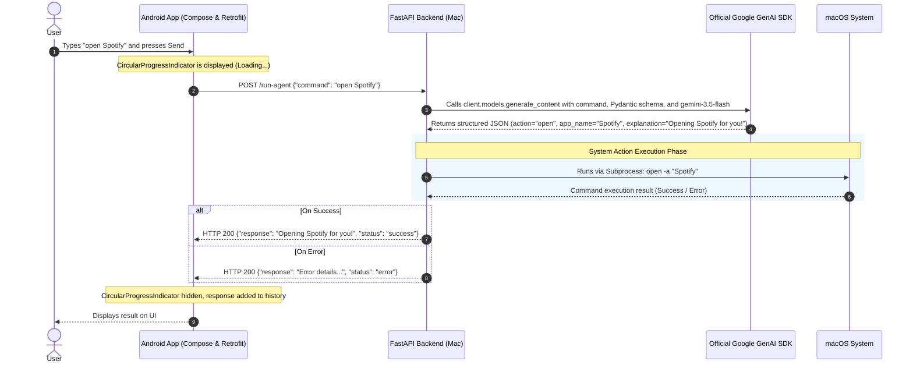

# Remote Mac Control - System Architecture (ARCHITECTURE.md)

This document explains how natural language commands sent from the Android mobile app (Frontend) are processed on the Mac computer (Backend), detailing the technologies used and the request lifecycle.

---

## 1. Overall Architectural Structure

The system consists of two core components:
1. **Android Frontend (Kotlin, Jetpack Compose, Retrofit)**: A modern, asynchronous mobile client where users input natural language commands and view the results.
2. **Mac Backend (Python, FastAPI, Official Google GenAI SDK, Gemini 3.5 Flash API)**: An intelligent agent server that interprets natural language from the Android device, generates system commands/AppleScripts, and executes them on macOS.

### Component Diagram

```
+-----------------------------------+
|        Android Mobile App         | <--- (Same Wi-Fi Network)
| - Jetpack Compose (UI)            |
| - ViewModel (State Management)    |
| - Retrofit (HTTP POST Request)    |
+-----------------------------------+
                 |
                 | HTTP POST /run-agent {"command": "open Spotify"}
                 v
+-----------------------------------+
|        Mac FastAPI Server         |
| - FastAPI (API Layer)             |
| - Uvicorn (ASGI Server)           |
+-----------------------------------+
                 |
                 | Passes Command to Agent
                 v
+-----------------------------------+
|     Official Google GenAI SDK     | <--- Structured Output (JSON)
| - Gemini 3.5 Flash Model          |
| - response_schema (Pydantic)      |
+-----------------------------------+
                 |
                 | Pydantic Output Parsing (action, app_name, url, explanation)
                 v
+-----------------------------------+
|     execute_app_control Function  |
| - Python Subprocess               |
| - MacOS Terminal / AppleScript    |
+-----------------------------------+
                 |
                 | Executes macOS System Commands
                 v
+-----------------------------------+
|             macOS OS              |
| - open -a "Spotify"               |
| - osascript -e 'quit app ...'     |
+-----------------------------------+
```

---

## 2. Request Lifecycle & Data Flow (Sequence Diagram)

The diagram below illustrates the step-by-step lifecycle of a request, from when a user types a command like "open Spotify" to the application opening and the response appearing on the mobile screen:



---

## 3. Detailed Component Responsibilities

### A. Android Frontend
- **User Interface (Jetpack Compose)**: A state-of-the-art UI utilizing Material 3 components. It provides a clean, premium visual style with a dark mode theme and beautiful gradient backdrops.
- **Asynchronous Processing (Coroutines & ViewModel)**: To prevent UI freezes, all network requests are executed on background threads (`Dispatchers.IO`). ViewModel handles UI state management reactively using `uiState` (Idle, Loading, Success, Error).
- **Dynamic IP Configuration & Retrofit Client**: Facilitates seamless JSON communication with the FastAPI server running on the Mac. Users can dynamically configure the target local IP address from the settings panel.

### B. Mac Backend (Python)
- **FastAPI / Uvicorn**: A high-performance, modern web framework with support for Python type hinting, offering automated Swagger UI documentation out of the box.
- **Official Google GenAI SDK (`google-genai`)**:
  - Directly leverages Google's flagship fast model, **`gemini-3.5-flash`**.
  - **Structured Outputs (Pydantic Schema)**: Uses `types.GenerateContentConfig` with `response_mime_type="application/json"` and `response_schema=AppControlAction` to guarantee 100% reliable, typed JSON parsing.
- **Application Management System (`execute_app_control`)**:
  - Uses Python's `subprocess` module to run shell commands securely on macOS.
  - **Opening Apps**: Triggers `open -a "{Application Name}"` to launch programs.
  - **Closing Apps**: Triggers an AppleScript command: `osascript -e 'quit application "{Application Name}"'`. This method ensures clean and graceful termination of target apps, saving unsaved progress.
  - **Opening URLs in Browser**: Triggers `open "{URL}"` (for system default browser) or `open -a "{Browser Name}" "{URL}"` (for specific browsers). It automatically normalizes raw web addresses (e.g. `google.com` -> `https://google.com`) before execution.
